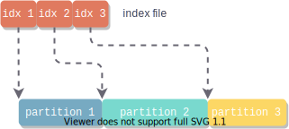

# 为什么会产生MapReduce

面对大量的数据，需要充分利用大量机器的运算资源来提高效率

但是，如何利用大量机器进行并行计算，如何分配数据到各个机器上，如何处理failure，在分布式的情况下都非常复杂

而MapReduce就是用来应对这种复杂性的抽象计算模型 。这个模型可以将大型数据处理任务分解成很多单个的、可以在服务器集群中并行执行的任务，而这些任务的计算结果可以合并在一起来计算最终的结果

MapReduce主要有两个过程：Map和Reduce

# Map过程

Map过程将原始数据转换成key/value pairs

以最简单的word count程序为例，这个程序的功能是计算文件中每个单词的出现次数


Map阶段， Map函数接收一个输入文件，对文件中的每一个单词输出一个键值对 `(word, occurrence)`, 这里每个单词出现就记occurrence为1，所以这里的键值对为`(word, 1)`

由此，我们将一个输入文件map到了一个key/value数组

```python
map(String key, String value):
    # key: document name
    # value: document contents
	for each word w in value:
        EmitIntermediate(w, "1")
```


# Reduce

对于map输出的key/value pairs, Reduce是将相同key值的value合并的过程

在word count程序中，map输出了`(word, 1)`键值对，为了计算一个单词出现的总数，需要将key/value pair中key相同的value加起来

每一个reducer处理特定的word。相同word的key/value pair进入同一个reducer, 统计计数

```python
reduce(String key, Iterator values):
    # key: a word
    # values: a list of counts
    int result = 0
    for each v in values:
        result += ParseInt(v)
    Emit(AsString(result))
```


# More Complex

MapReduce实际细节中还包含更复杂的partition, shuffle, merge过程


## Map端Shuffle

### 整体思路

可以预期，map过后，我们会得到无序的键值对，如下所示。每一个key的数据都可能分散在各个位置

```python
a, 1
b, 1
a, 1
c, 1
a, 1
b, 1
c, 1
```

然而reducer是术业有专攻的，在reduce过程中，相同key值的数据需要被送到同一个reducer

若要去一个一个文件全局搜索去寻找对应的key值，效率必然是低下的

因此，我们希望map输出是聚集在一起的, 像下面这样。如此一来，寻找对应的key值就会很快

```python
a, 1
a, 1
a, 1
b, 1
b, 1
c, 1
c, 1
```


当然，为了能够更快定位到reducer需要的key值部分，加上索引是更快捷的做法

我的想法是索引和数据在同一文件，如下图


但似乎一般做法是索引与数据分离，让索引都存在于内存中




接下来考虑如何才能让键值相同的数据聚集在一起呢？

方法1: HashMap

方法2: Sort

用这两种方法的都有。sort耗费时间开销大，hashmap耗费空间开销大。这里我们基于sort


### Partition

Map端输出是发送给N个Reducer做Reduce工作

因此，我们需要将Map端的文件映射到Reducer, 相同键值的映射到同一个Reducer, 且尽量保证其负载均衡

这是做Partition的目的。


在Partition方式上，我们为key/value pair增加一个partition属性，这个partition属性是对key计算hash计算得到的，为了一个partition对应一个reducer, 在计算hash时对reducer的数量取模

partition值为几，该key/value pair就会进入第几个reducer

hash得到的partition能够保证相同键值的数据映射到同一个partition, 也就是reducer，但是一个partition不能保证只有一种键值


### Collector

一个环状数组，最大限度地利用内存

内存占用到一定程度，就会触发spill, 写入磁盘


环状数组存储两类数据

- 原始的Key-Value数据
- Metadata数据：（注意Key, Value的大小不是固定的，所以需要存长度）

- - Key的起始位置
  - Value的起始位置

- - Value的长度
  - Partition

选定Equator, 这两类数据以Equator为起点，向两个相反的方向增长

当数据达到一定阈值(比如80%时），Key-Value数据要写入磁盘。

此时，空余的20%缓冲区可以用来接收新来的数据，此前，要重新选定Equator


### Sort

Spill触发后，在写入磁盘前，将Collector中的数据按照partition和key对数据进行升序排序

按照Partition排序是为了让相同partition数据的聚集在一起，但是一个partition不是只有一种键值，因此再对键值排序保证了相同键值的数据聚集在一起


注意，不对Key-Value数据排序，而是对**Metadata**排序

- 读取Metadata, 将Metadata数据按照Partition进行排序
- 在同一Partition中，读取Metadata对应的Key值，按照Key值再次排序


### Combine(自定义优化步骤)

将Map输出的key/value pair进行合并，是一个本地reduce过程

比如word count程序，map输出

```python
a, 1
a, 1
a, 1
```

我们就可以定义一个combine程序，将其合并为`(a, 3)`再发送给reducer

### Spill

- 创建磁盘文件
- 将Collector中的数据按照Metadata排序顺序依次写入文件，写磁盘的时候数据会进行压缩

- 同时会创建索引文件。索引文件对每一个partition会记录一个三元组 `(起始位置，原始数据长度，压缩后的数据长度)`, 在这个文件中也会存储crc32的校验数据


### Merge

在数据量大的时候，有可能进行好几次spill, 产生了多个数据文件和索引文件，这个时候就需要将文件合并

如何获得Spill文件呢--->扫描本地目录, 然后把文件路径存到数据里面，索引文件同理

对于1个Partition，扫描索引文件，得到k个数据文件，做一个k路外部排序

如果设置了combiner, Merge时也会调用combiner合并key相同的数据


Map Shuffle整体结构


# Reduce Shuffle

Reduce Shuffle主要有两个过程：

- Copy
- Merge

## Copy

将Map得到的数据copy到本地

## Merge

做一个数据的外部排序


# Reference

[1] [环形缓冲区](https://plandocheckaction.github.io/2020/09/07/BigData14-MapReduceSuffle/)

[2] [Hadoop中的压缩](https://www.cnblogs.com/edisonchou/p/4298423.html)

[3] [External Sorting](https://stackoverflow.com/questions/5100252/external-sorting)

[4] [MapReduce计算框架](https://zhuanlan.zhihu.com/p/55884610)