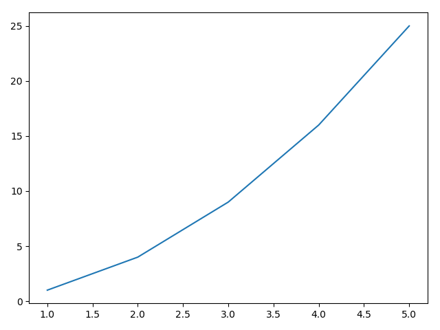
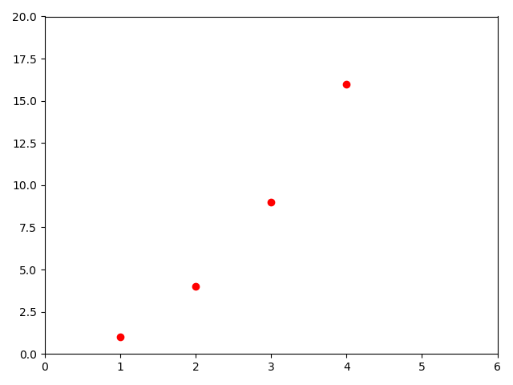

==基础步骤

先画一个简单的图


==高级设置

做出论文里要求的图

==figsize

==font

==marker

==color

==坐标轴

==图例


==多子图情况


# 基础绘图

```python
import matplotlib.pyplot as plt


x = [1, 2, 3, 4, 5]
y = [1, 4, 9, 16, 25]

plt.plot(x, y)
plt.show()
```




```python
import matplotlib.pyplot as plt


plt.plot([1, 2, 3, 4], [1, 4, 9, 16], 'ro')
plt.axis([0, 6, 0, 20])
plt.show()
```




 [`axis`](https://matplotlib.org/stable/api/_as_gen/matplotlib.pyplot.axis.html#matplotlib.pyplot.axis) function in the example above takes a list of `[xmin, xmax, ymin, ymax]` and specifies the viewport of the axes.

